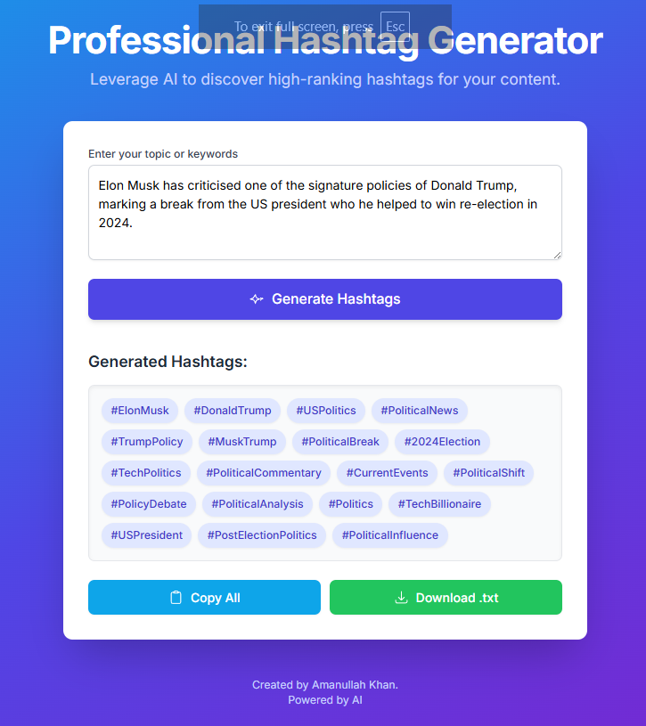

# 🚀 Professional Hashtag Generator

An AI-powered web application that generates professional, high-quality hashtags from any text passage. Perfect for content creators, marketers, and influencers who want to boost engagement with optimized, context-aware hashtags.

## ✨ Features

- 🔍 Contextual understanding of input passages
- 🧠 AI-generated, high-ranking hashtags
- ⚡ Fast and responsive UI built with Vite + React + TypeScript
- 🌐 Mobile-friendly design
- 📦 Lightweight and easy to deploy

## 📸 Preview



## 🛠️ Technologies Used

- React
- TypeScript
- Vite
- AI Studio / Google AI
- Tailwind CSS (or custom CSS)

## LIVE DEMO
https://hashtage-generator-2-0.vercel.app/

## 🙋‍♂️ Author
Made with ❤️ by Amanullah Khan

## 📫 Connect with Me
GitHub: github.com/amanullahykhan

## 🚀 Getting Started

### 1. Clone the Repository

```bash
git clone https://github.com/amanullahykhan/hashtage-generator-2.0.git
cd hashtage-generator-2.0

Visit http://localhost:5173 to view it in your browser.

### 2. Mobile Preview
Edit vite.config.ts to allow network access:

ts
Copy
Edit
export default defineConfig({
  server: {
    host: '0.0.0.0'
  }
});
Then open http://<your-local-ip>:5173 on your phone (same Wi-Fi).


## 🌍 Deployment
You can deploy this app on any static hosting platform:

Vercel

Netlify

Firebase Hosting


